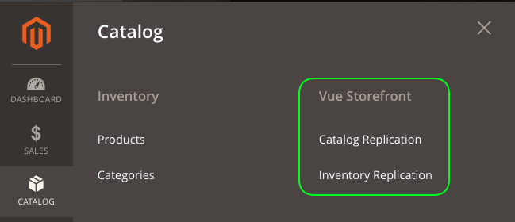
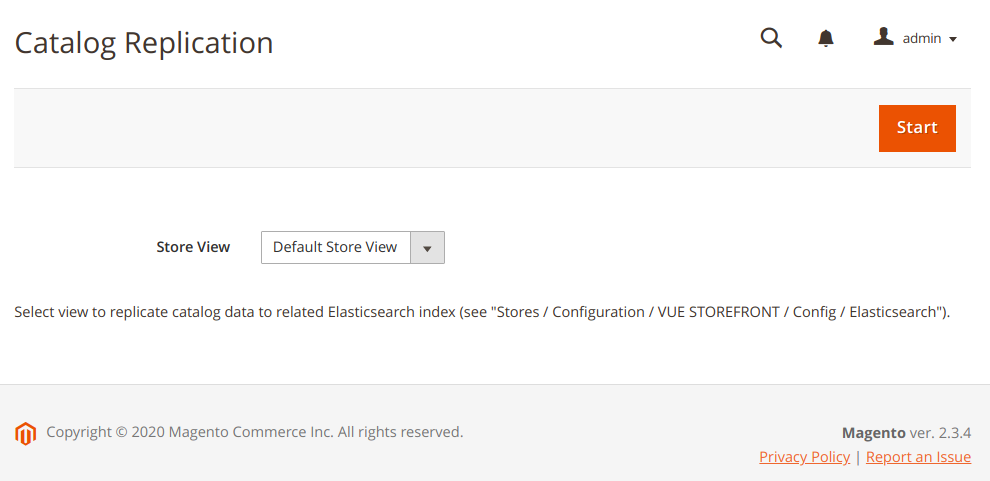
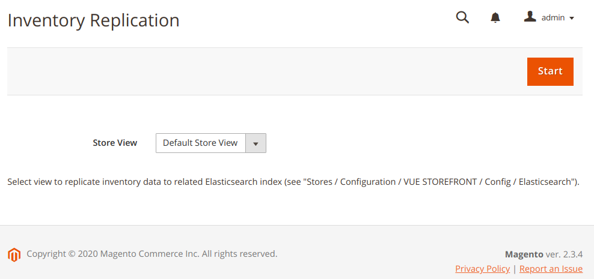
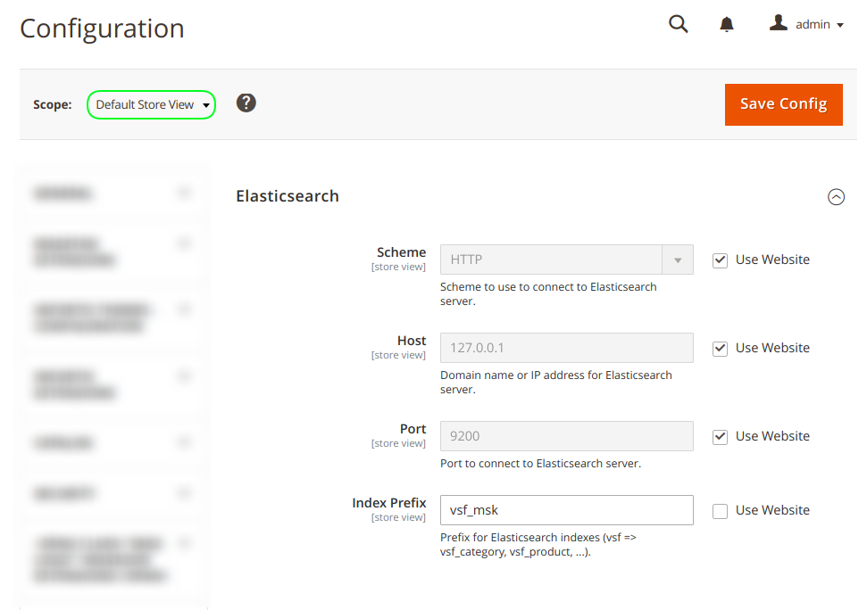

# mage2_mod_vsf_adapter
Magento 2 module to use Magento apps with VueStorefront.

**Attention: this module is used for one project only and is not generic but you can try to use it for your own projects.**


## Functionality
* Full replication for catalog data (categories, products & products attributes) been started from CLI & adminhtml.
* Inventory data replication for items in Elasticsearch (product prices & qty) been started from CLI & adminhtml.

Only simple products are replicated correctly.


## Start replication from CLI
```shell script
$ ./bin/magento fl32:vsf:replicate:catalog -i vsf_store3 -s 3
$ ./bin/magento fl32:vsf:replicate:inventory -i vsf_store3 -s 3
```

Replication log see in `./var/log/vsf.log`.

Use `crontab` to setup periodical replication.


## Start replication from admin



### Catalog replication
Go to `Admin / CATALOG / Vue Storefront / Catalog Replication` to clean up Elasticsearch and replicate categories, products and products attributes:


Expected output in admin:
```
2020-03-10/16:35:04-VSF.INFO - Catalog replication is started.
2020-03-10/16:35:04-VSF.INFO - Catalog replication parameters: index 'vsf_msk', store 1.
2020-03-10/16:35:04-VSF.INFO - Total '237' category items were loaded from Magento.
2020-03-10/16:35:05-VSF.INFO - Total '60' product attributes items were loaded from Magento.
2020-03-10/16:35:25-VSF.INFO - Total '3731' product items were loaded from Magento.
2020-03-10/16:35:47-VSF.INFO - Total '3731' products & '57' attributes were converted to Elasticsearch compatible format.
2020-03-10/16:35:47-VSF.INFO - Attributes data is deleted from ElasticSearch (0 items).
2020-03-10/16:35:47-VSF.INFO - '57' attribute items were created ('0' requests have other result).
2020-03-10/16:35:47-VSF.INFO - Categories data is deleted from ElasticSearch (0 items).
2020-03-10/16:35:48-VSF.INFO - '237' category items were created ('0' requests have other result).
2020-03-10/16:35:48-VSF.INFO - Products data is deleted from ElasticSearch (0 items).
2020-03-10/16:36:09-VSF.INFO - '3731' product items were created ('0' requests have other result).
2020-03-10/16:36:09-VSF.INFO - Catalog replication is completed.
```
Full log for replication see in `./var/log/vsf.log`.


### Inventory replication
Go to `Admin / CATALOG / Vue Storefront / Inventory Replication` to update inventory data (prices & qty) for products in Elasticsearch:


Expected output in admin:
```
2020-03-10/16:38:31-VSF.INFO - Inventory replication is started.
2020-03-10/16:38:31-VSF.INFO - Inventory replication parameters: index 'vsf_msk', store 1.
2020-03-10/16:38:31-VSF.INFO - '3731' products are found in Elasticsearch.
2020-03-10/16:38:48-VSF.INFO - Total '3731' product items were loaded from Magento.
2020-03-10/16:39:05-VSF.INFO - Total '3731' products were converted to Elasticsearch compatible format.
2020-03-10/16:39:05-VSF.INFO - '0' products were disabled.
2020-03-10/16:39:08-VSF.INFO - '0' product items were updated and '3731' were unchanged ('0' requests have other result).
2020-03-10/16:39:08-VSF.INFO - Inventory replication is completed.
```
Full log for replication see in `./var/log/vsf.log`.


## Configuration
Go to `Admin / STORES / VUE STOREFRONT / Config` to setup Elasticsearch connection parameters and index prefix:


Switch scope to configure different VSF apps for different views.
